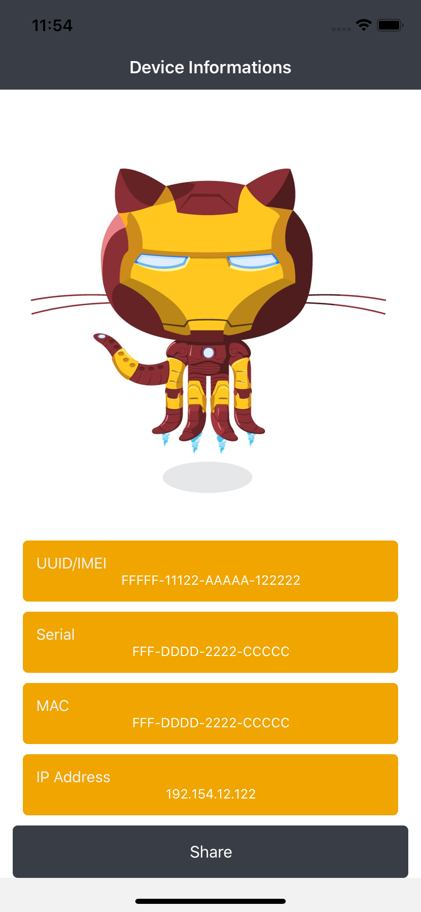

### **Saudações.**

O intuito desse repo é testar algumas bibliotecas que estão em alta e que tenho vontade de enteder melhor a arquitetura utilizada.

Por enquanto, o Aplicativo tem a simples função de mostrar as informações do aplicativo, ele pode evoluir mas a ideia é não ter nenhuma funcionalidade especifica, somente para motivos de estudo.

Por enquanto ele está utilizando as seguintes bibliotecas: 

- "@react-native-community/async-storage": "^1.11.0",
- "@react-native-community/masked-view": "^0.1.10",
- "@react-navigation/native": "^5.5.1",
- "@react-navigation/stack": "^5.5.1",
- "@testing-library/react-native": "^5.0.3",
- "react": "16.13.1",
- "react-native": "0.63.0",
- "react-native-device-info": "^5.6.1",
- "react-native-gesture-handler": "^1.6.1",
- "react-native-safe-area-context": "^3.0.4",
- "react-native-screens": "^2.8.0",
- "react-redux": "^7.2.0",
- "redux": "^4.0.5",
- "redux-saga": "^1.1.3",
- "reduxsauce": "^1.1.3"